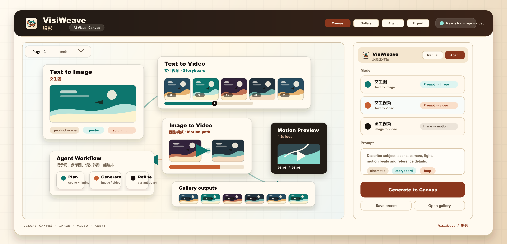

# VisiWeave

[English](README.md) | [简体中文](README.zh-CN.md)

VisiWeave, also known as 织影, is a local-first AI visual workspace for weaving prompts, references, generated images, Agent plans, and videos into one editable canvas. It combines tldraw, a Hono API, SQLite persistence, OpenAI-compatible image providers, video provider adapters, Agent planning, and optional cloud backup so creators can generate, arrange, revisit, and export assets from one workstation.

Current version: `v0.2.0`.

The public product name is `VisiWeave / 织影`. Some package names, workspace filters, and local database filenames still use the historical `gpt-image-canvas` identifier for compatibility.

## Preview



## Highlights

- Infinite tldraw canvas for arranging generated images, references, and Agent plan nodes as a visual production board.
- Manual prompt-to-image generation with size, quality, format, and style controls.
- Reference-image generation from selected canvas images.
- Agent planning for multi-image jobs, with inspectable DAG execution and retry support.
- Creative Video and Video Library workflows for text-to-video jobs and saved local video assets.
- Image provider configuration from `.env`, local in-app settings, or Codex login fallback.
- Video provider configuration for keyframe image video, Grok Imagine, and custom HTTP/OpenAI-compatible video gateways.
- Local SQLite history for projects, generated assets, provider settings, Agent settings, and optional Tencent Cloud COS backup state.
- Gallery tools for browsing, locating, rerunning, downloading, and inspecting local outputs.

## Requirements

- Node.js `24.15.0`; the repository includes `.nvmrc` and `.node-version`.
- pnpm `9.14.2`; the package manager is pinned in `package.json`.
- An OpenAI API key with access to `gpt-image-2`, an OpenAI-compatible image endpoint, or Codex login completed inside the app.
- Docker Desktop or a compatible Docker Engine if you want the Docker workflow.

Activate the pinned package manager with Corepack when needed:

```sh
corepack prepare pnpm@9.14.2 --activate
```

## Quick Start

Windows PowerShell:

```powershell
pnpm install
Copy-Item .env.example .env
pnpm dev
```

macOS/Linux:

```sh
pnpm install
cp .env.example .env
pnpm dev
```

Open the web app at [http://localhost:5173](http://localhost:5173).

`pnpm dev` starts both local services:

- API: [http://127.0.0.1:8787](http://127.0.0.1:8787)
- Web: [http://localhost:5173](http://localhost:5173), proxying `/api` to the API service

The app can start without credentials. Without a configured provider, `/` shows the credential-aware home page and generation requests return `missing_provider` until you configure one.

## Configure Image Generation

The image provider source order is:

1. Environment OpenAI-compatible config from `.env` or runtime variables.
2. Local OpenAI-compatible config saved in the app.
3. Codex login fallback.

For the simplest API-key setup, edit `.env`:

```env
OPENAI_API_KEY=
OPENAI_BASE_URL=
OPENAI_IMAGE_MODEL=gpt-image-2
OPENAI_IMAGE_PROVIDER_FORMAT=newapi
OPENAI_IMAGE_TIMEOUT_MS=1200000
```

Leave `OPENAI_BASE_URL` empty for the official OpenAI API. Set it to an OpenAI-compatible `/v1` endpoint when using another provider, and set `OPENAI_IMAGE_MODEL` if that endpoint expects a different model name.
`OPENAI_IMAGE_PROVIDER_FORMAT` defaults to `newapi`; set it to `sub2api` for Sub2API-compatible image endpoints that return streamed image events, or `gemini` for Gemini `generateContent`-compatible endpoints.

[img.hanhegufei.online](https://img.hanhegufei.online/) is a third-party Gemini `generateContent` source and supports native image generation up to 4K.

You can also open the top-right provider settings dialog and save one local OpenAI-compatible provider. Local keys are stored in SQLite under `DATA_DIR`, returned only as masked values, and preserved until you enter a replacement key.

## Configure Video Generation

Video generation is optional and configured separately from image generation.

The supported video provider kinds are:

- `keyframe-image`: creates video from generated image keyframes and FFmpeg interpolation.
- `grok-imagine`: calls Grok Imagine-compatible video endpoints and common relay shapes.
- `custom-http`: calls an OpenAI-compatible/custom HTTP video gateway.

Example `.env` values:

```env
VIDEO_PROVIDER_KIND=grok-imagine
VIDEO_PROVIDER_URL=https://video-provider.example.com/v1
VIDEO_PROVIDER_MODEL=grok-imagine-video
VIDEO_PROVIDER_API_KEY=
VIDEO_PROVIDER_DOWNLOAD_PROXY_URL=
```

For custom HTTP video gateways, the app can use a base URL or mode-specific URLs:

```env
VIDEO_PROVIDER_KIND=custom-http
VIDEO_PROVIDER_URL=https://video-provider.example.com
VIDEO_PROVIDER_TEXT_TO_VIDEO_URL=
VIDEO_PROVIDER_IMAGE_TO_VIDEO_URL=
VIDEO_PROVIDER_STATUS_URL=
VIDEO_PROVIDER_MODEL=grok-imagine-video
VIDEO_PROVIDER_API_KEY=
```

Video provider secrets must stay in `.env` or the local SQLite database. Do not commit real keys.

## Routes

- `/` is the credential-aware home page. It offers Codex login and API setup when no provider is available.
- `/canvas` is the working canvas. Without a provider, it redirects back to `/`.
- `/gallery` remains available even without credentials, so local image work can still be viewed.
- `/creative-video` is the video generation workspace.
- `/video-library` lists saved local video outputs and job status.

Environment values are read-only in the provider dialog. Restart the API or Docker container after changing `.env`.

## Using The Canvas

The right-side panel has two main flows:

- `Manual`: enter a prompt, choose size/quality/format, and generate. Selecting one image shape switches the flow into reference-image generation.
- `Agent`: describe a multi-image task, optionally select up to three canvas images, review the generated plan node, then execute it.

Agent planning uses a separate OpenAI-compatible chat configuration from the image provider. Save it in Agent LLM settings with API key, base URL, model, timeout, and `supportsVision`.

When `supportsVision` is enabled, selected images are attached to the planning request as multimodal inputs. When disabled, selected images are passed only as reference handles for later image generation. Agent messages are not persisted in this version; plan nodes already on the canvas are saved with the normal canvas snapshot.

Plan execution is DAG-based. Independent jobs can run in parallel, jobs that reference generated outputs wait for their dependencies, and `Retry failed` reruns failed or blocked jobs while keeping successful upstream outputs. A single plan is capped at 16 generated images, including intermediate anchors.

## Cloud Backup

Generated images are always saved locally first. If Tencent Cloud COS is enabled from the in-app cloud storage dialog, new images are also uploaded to:

```text
<key-prefix>/YYYY/MM/<assetId>.<ext>
```

The COS dialog is prefilled from:

- `COS_DEFAULT_BUCKET`
- `COS_DEFAULT_REGION`
- `COS_DEFAULT_KEY_PREFIX`

Saving COS settings performs a test upload and delete before the config is persisted. `SecretKey` is stored in local SQLite and only returned as a masked value. COS upload failures do not fail image generation; the image remains available locally and the history item shows the upload failure.

## Project Layout

```text
apps/api          Hono API, SQLite storage, provider selection, Agent planning/execution, video jobs
apps/web          Vite + React + tldraw web app
packages/shared   Shared contracts and constants
docs              Project docs and preview assets
data              Local runtime data, ignored by Git
```

## Scripts

| Command | Description |
| --- | --- |
| `pnpm dev` | Start API and web dev servers. |
| `pnpm api:dev` | Start the API dev workflow. |
| `pnpm web:dev` | Start the Vite web dev workflow. |
| `pnpm typecheck` | Typecheck shared, web, and API packages. |
| `pnpm build` | Build shared, web, and API packages. |
| `pnpm start` | Start the built API package. |
| `pnpm --filter @gpt-image-canvas/api smoke:planner` | Check Agent plan validation fixtures. |
| `pnpm --filter @gpt-image-canvas/api smoke:agent` | Check Agent config and WebSocket basics. |
| `pnpm --filter @gpt-image-canvas/api smoke:executor` | Check Agent DAG execution with a fake image provider. |
| `pnpm --filter @gpt-image-canvas/api smoke:provider-video-config` | Check video provider configuration behavior. |
| `pnpm --filter @gpt-image-canvas/api smoke:grok-imagine-video` | Check Grok Imagine video gateway handling. |
| `pnpm --filter @gpt-image-canvas/api smoke:custom-http-grok2api-video` | Check custom HTTP/grok2api-style video handling. |

Before completing code changes, run:

```sh
pnpm typecheck
pnpm build
```

For UI changes, run `pnpm dev` and verify the Vite app in a browser at [http://localhost:5173](http://localhost:5173).

If `better-sqlite3` reports a `NODE_MODULE_VERSION` mismatch after switching Node versions, rebuild it:

```sh
pnpm --filter @gpt-image-canvas/api rebuild better-sqlite3 --stream
```

## Docker

Docker Compose builds shared contracts, the web app, and the API into one image. The API serves both `/api` and the built web bundle from one localhost port. SQLite data and generated assets persist in host `./data`.

Use the repository startup script to create local `.env` when missing, validate Compose without expanding secrets, and start the container:

Windows PowerShell:

```powershell
.\scripts\docker-start.ps1
```

macOS/Linux:

```sh
sh scripts/docker-start.sh
```

For detached mode:

```powershell
.\scripts\docker-start.ps1 -Detached
```

```sh
sh scripts/docker-start.sh --detached
```

Manual startup is equivalent to:

```sh
docker compose config --quiet --no-env-resolution
docker compose up --build
```

Open [http://localhost:8787](http://localhost:8787) by default. Set `PORT` in `.env` before starting Compose to use a different localhost port, for example `PORT=8788`.

Use `docker compose config --quiet --no-env-resolution` when real credentials exist. Plain `docker compose config` expands env files and can print secrets.

Compose defaults `SQLITE_JOURNAL_MODE=DELETE` and `SQLITE_LOCKING_MODE=EXCLUSIVE` to avoid SQLite shared-memory errors on Docker Desktop bind mounts. Avoid running `pnpm dev` and Docker against the same `data/` directory at the same time.

The Compose build accepts these network-related build args. Set them explicitly in `.env` or the shell when your network needs a registry or apt mirror:

- `NODE_IMAGE`
- `NPM_CONFIG_REGISTRY`
- `APT_MIRROR`
- `APT_SECURITY_MIRROR`

The default `NODE_IMAGE` is `node:24.15.0-bookworm-slim`.

## Runtime Data And Secrets

`DATA_DIR` defaults to `./data` locally and `/app/data` in Docker. It contains:

- `gpt-image-canvas.sqlite`: project state, generation history, asset metadata, provider config, Agent LLM config, optional COS config, and Codex OAuth token records.
- `assets/`: generated image and video files.

Do not commit `.env`, `.ralph/`, `.codex-temp/`, `data/`, generated assets, SQLite databases, or build output.

Treat `data/gpt-image-canvas.sqlite` as sensitive after saving local provider keys, Agent LLM keys, COS secrets, or Codex tokens. The app is designed for local workstation use; do not expose it publicly without adding your own authentication and network controls.

If a real API key was ever committed, rotate the key. Git ignore rules prevent future leaks, but they do not remove secrets from existing Git history.

## Troubleshooting

- Missing provider: add `OPENAI_API_KEY` to `.env` and restart, save a local provider from settings, or complete Codex login.
- Custom image endpoint fails: confirm `OPENAI_BASE_URL` points to an OpenAI-compatible `/v1` endpoint, supports the configured image model, and uses the matching `OPENAI_IMAGE_PROVIDER_FORMAT` (`newapi` or `sub2api`).
- Video provider fails: confirm `VIDEO_PROVIDER_KIND`, URL, model, and API key match the selected gateway.
- Agent cannot plan: save the Agent LLM config separately from the image provider config. If `supportsVision` is enabled and the request fails, try fewer or smaller selected images.
- Port conflict: set `PORT` for API/Docker. For web dev, stop the process on `5173` or run `pnpm web:dev -- --port 5174`.
- Docker cannot pull the base image: restore Docker Hub access or set `NODE_IMAGE` to an equivalent cached Node `24.15.0` image.
- SQLite `SQLITE_IOERR_SHMOPEN` in Docker: keep the Compose SQLite defaults, rebuild, and make sure no local API process is using the same database.
- SQLite `SQLITE_CORRUPT`: stop all app processes, back up `data/`, then restore from backup or remove the SQLite files to create a clean database. Files under `data/assets/` can be kept.

## Upgrading

Before upgrading an older local install, back up runtime data:

Windows PowerShell:

```powershell
Copy-Item -Recurse data data-backup-before-upgrade
docker compose up --build
```

macOS/Linux:

```sh
cp -R data data-backup-before-upgrade
docker compose up --build
```

Rebuild the web app and API together after an upgrade.

## License

MIT

## Links

- [LINUX DO](https://linux.do/)

## Acknowledgements

Thanks to the public-welfare API sites [api.futureppo.top](https://api.futureppo.top/) and [api.pie-xian.com](https://api.pie-xian.com/) for providing video generation and image generation services.
